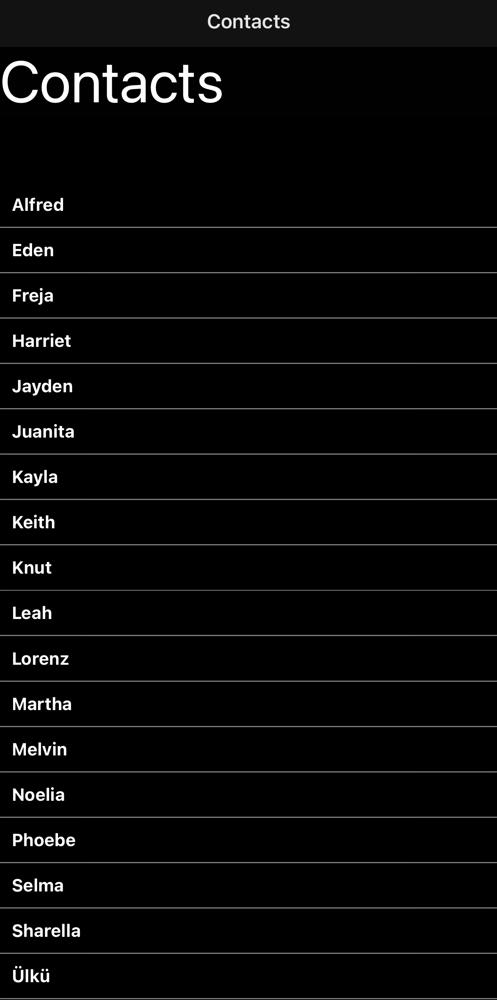

# JavaScript React Native - Contact Book

Uses a authentication service and database from Firebase to store the contacts in the cloud instead of local.

Contains basic unit and component testing with react-native-tesing library and Jest.

UI more or less done, needs some more functionality before being completed.

2022-10-06 update

Continued on from the bones of mob-week and refactored the code to be more modular and added mail, sms and calling functionality as well as some UI and other minor tweeks. 

  

